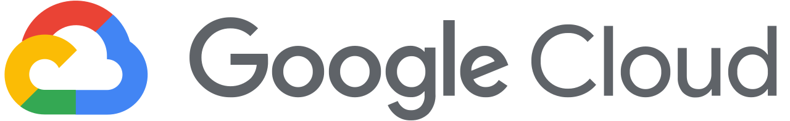

# Google Cloud Storage

## Introduction

Google Cloud Storage offers a highly scalable, secure, and durable object storage service designed to handle unstructured data across various use cases. With a unified API and integration across Google Cloud services, it supports efficient data retrieval and storage management. Its tiered storage options—ranging from high-performance to cost-effective archival—make it a versatile solution. Beyond its native ecosystem, Google Cloud Storage is widely adopted for hybrid and multi-cloud strategies due to its interoperability and global availability.

Follow the guide below to set up an account and get HMAC credentials on GCP:

<details>

<summary>Getting Started with   Storage</summary>

## Setting Up Google Cloud Storage

**1. Create a Google Cloud Account:**

* Visit the [Google Cloud website](https://cloud.google.com/) and click on “**Get started for free**.”
* Follow the prompts to set up your account, including verifying your email and providing billing information.

**2. Access the Google Cloud Console:**

* Once your account is active, log in to the [Google Cloud Console](https://console.cloud.google.com/).

**3. Create a Storage Bucket:**

* In the console, navigate to the Cloud Storage section.
* Click on “**Create bucket.**”
* Provide a globally unique name for your bucket.
* Select a location for your bucket (e.g., “US”).
* Choose a default storage class (e.g., “Standard”).
* Set access control to “Uniform” to manage permissions uniformly at the bucket level.
* Click “**Create**” to finalize the bucket setup.

***

## Generating Google Cloud Storage Credentials

To allow ByteNite to interact securely with your Google Cloud Storage buckets, you need to create a service account and generate HMAC (Hash-based Message Authentication Code) credentials.

**1. Create a Service Account:**

* In the Google Cloud Console, navigate to **IAM & Admin** > **Service Accounts**.
* Click on “**Create Service Account**.”
* Provide a name (e.g., bytenite-service-account) and an optional description.
* Click “**Create and Continue.**”

**2. Assign Permissions to the Service Account:**

* Assign the Storage Object Admin role to grant full control over objects in your buckets.
* Click “**Continue**,” then “**Done**” to finish creating the service account.

**3. Generate HMAC Credentials:**

* In the Google Cloud Console, navigate to **Cloud Storage** > **Settings**.
* Open the **Interoperability** tab.
* Under Service Account HMAC, click “**Create a key for a service account**.”
* Select the service account you created earlier (bytenite-service-account).
* Click “**Create Key**.”
* The console will display the **Access Key** and **Secret Key**.
* Important: Save these credentials securely, as the Secret Key will not be displayed again.

**Additional Notes:**

* For comprehensive details about creating buckets, refer to the official Google Cloud documentation on [creating buckets](https://cloud.google.com/storage/docs/creating-buckets).
* For detailed information on managing HMAC keys, consult the documentation on [HMAC keys](https://cloud.google.com/storage/docs/authentication/hmackeys).

</details>


***

## Google Cloud Storage Secret&#x20;


`secretType`  : **`gcp`**


If your Google Cloud bucket requires authentication for read or write access, set up a secret to store your Service Account HMAC credentials securely with ByteNite (see [#setting-up-secrets](./#setting-up-secrets "mention"))

Here's an example of a request body of the [secrets.md](../../api-reference/authentication-api/secrets.md "mention") endpoint for saving Google Cloud keys:


```json
{
    "secret": {
        "id": "my_gcp_secret",
        "secretType": "gcp",
        "expiresAt": "2025-12-29T18:02:27.140Z", 
        "accessKey": "GOOG1AB7QD3TY4NSFIZHD4KPB6LVB4F53UJGEZEMRJDXO5PUYDXAOSIKUFNI",
        "name": "GCP Bucket Admin Project 'My App'"
    },
    "secretKey": "aBcDeFgHiJkLmNoPqRsTuVwXyZ1234567890+/ExAmPlEkEy"
}
```



***

## Google Cloud Storage Data Source Object


`dataSourceDescriptor`  : **`gcp`**

`@type`  : [**`type.googleapis.com/bytenite.data_source.S3DataSource`**](#user-content-fn-1)[^1]&#x20;


Set up your data source with Google Cloud storage using the your previously configured gcp secret and the following `params` :

<details>

<summary><code>@type</code>  <em><strong>string</strong></em></summary>

**Description:**

Use the `type.googleapis.com/bytenite.data_source.S3DataSource` params type.

</details>

<details>

<summary><code>bucketName</code>  <em><strong>string</strong></em></summary>

**Description:**

The name of your Google Cloud bucket.

**Example:**

"my-app-data-bucket-12345"

</details>

<details>

<summary><code>cloudRegion</code>  <em><strong>string</strong></em></summary>

**Description:**

The Google Cloud bucket's region name.

**Example:**

"us-west2-b"

</details>

<details>

<summary><code>name</code>  <em><strong>string</strong></em></summary>

**Description:**

* _Usage for **Data Sources**:_\
  The **path** to your input **file** following the bucket name.
* _Usage for **Data Destinations**:_\
  The **path** to the output **folder** following the bucket name. Note: a path will be created if it doesn't exist.

**Example:**

* _Data Source:_\
  "/vids/big\_buck\_bunny.mp4"
* _Data Destination:_\
  "/vids/encoded/"

</details>

<details>

<summary><code>secret_id</code>  <em><strong>string</strong></em></summary>

**Description:**

The ID of an existing `gcp` secret.

**Example:**

"my\_gcp\_secret"

</details>


Here is an example Google Cloud data source and destination request body:


```json
{
    "dataSource": {  
        "dataSourceDescriptor": "gcp", 
        "params": {  
            "@type": "type.googleapis.com/bytenite.data_source.S3DataSource",  
            "name": "/vids/big_buck_bunny.mp4",
            "bucketName": "my-app-data-bucket-12345",
            "cloudRegion": "us-west2-b",
            "secret_id": "my_gcp_secret"
        }  
    },
    
    "dataDestination": {  
        "dataSourceDescriptor": "gcp", 
        "params": {  
            "@type": "type.googleapis.com/bytenite.data_source.S3DataSource",  
            "name": "/vids/encoded/",
            "bucketName": "my-app-data-bucket-12345",
            "cloudRegion": "us-west2-b",
            "secret_id": "my_gcp_secret"
        }  
    }
}
```


[^1]: This data source belongs to the S3-compatible object storage category. We use the same API request structure for all data sources having this @type.
