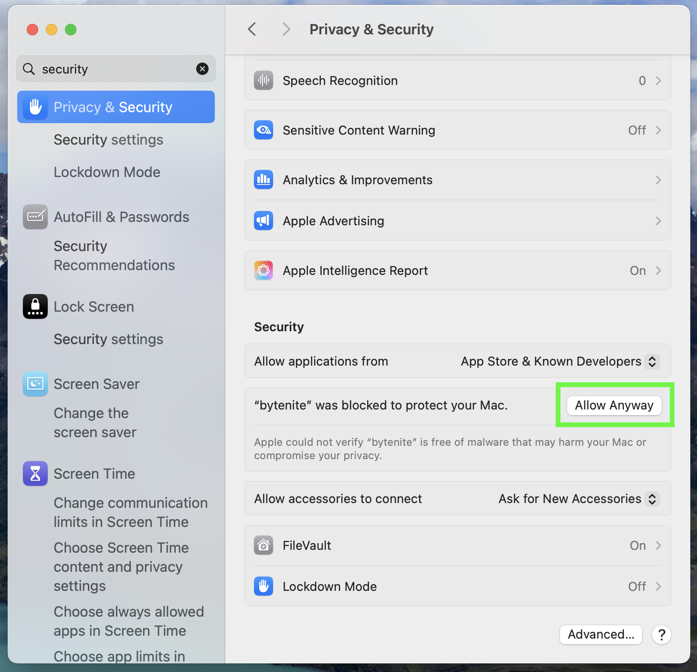

# ByteNite Dev CLI

The Dev CLI is a tool for developers to create and manage apps on ByteNite.

## Download & Install

### Linux

Follow these steps to install the ByteNite CLI on Ubuntu, Debian, or similar distributions.

1. **Add the ByteNite Repository**

```bash
echo "deb [trusted=yes] https://storage.googleapis.com/bytenite-prod-apt-repo/debs ./" | sudo tee /etc/apt/sources.list.d/bytenite.list
```

2. **Update Package Lists**

```bash
sudo apt update
```

3. **Install the ByteNite CLI**

```bash
sudo apt install bytenite
```

#### Troubleshooting

If you encounter any issues during installation:

*   Make sure your system is up-to-date:

    ```bash
    sudo apt update && sudo apt upgrade
    ```
*   Verify the repository was correctly added:

    ```bash
    cat /etc/apt/sources.list.d/bytenite.list
    ```
*   Check if the package is available

    ```bash
    apt search bytenite
    ```

### Mac

1. **Add the Bytenite Tap**

```bash
brew tap ByteNite2/bytenite-dev-cli https://github.com/ByteNite2/bytenite-dev-cli.git
```

2. **Install the CLI**

```bash
brew install bytenite
```

<details>

<summary>Additional Permissions for Mac Users</summary>

Mac users might need to manually grant permissions in **System Settings > Privacy & Security** after executing a ByteNite command for the first time.

Follow the necessary steps as shown in the image below to let your OS know ByteNite is safe to use.

   &#x20;

</details>

### Windows

Download and run the latest Windows release from [ByteNite CLI on GitHub](https://github.com/ByteNite2/bytenite-dev-cli/releases).


***

**Verify Installation**

Check that the installation was successful by using:

```bash
bytenite version
```


***

## Authenticate

To authenticate, run:

```bash
bytenite auth
```

This will open an oAuth2 authentication page in your browser. The login is automatic if you're already logged in on ByteNite.

After successful authentication, credentials will be stored in the application support or configuration directory:

* **Linux**: `/$HOME/.config/bytenite-cli/auth-prod.json`
* **Mac**: `/Users/[user]/Library/Application Support/bytenite-cli/auth-prod.json`


***

## Commands & Usage

Run the help command to get started with the ByteNite Dev CLI:

```bash
bytenite --help
```

**Authentication**

* Authenticate with OAuth2: `bytenite auth`

**Version**

* Get Dev CLI Version: `bytenite version`

**App Commands**

* App Command Info: `bytenite app --help`
* Initialize New App: `bytenite app new [app_name]`
* Push/Upload App: `bytenite app push [app_folder]`
* Pull/Download App: `bytenite app pull [app_tag]`
* Get App Details: `bytenite app get [app_tag]`
* List Existing Apps: `bytenite app list`
* Activate App: `bytenite app activate [app_tag]`
* Deactivate App: `bytenite app deactivate [app_tag]`
* Get App Status: `bytenite app status [app_tag]`

**Template Commands**

* Template Command Info: `bytenite template --help`
* Initialize New Template: `bytenite template new [template_id]`
* Push/Upload Template: `bytenite template push [template_filepath]`
* Pull/Download Template: `bytenite template pull [template_id]`
* Get Template Details: `bytenite template get [template_id]`
* List Existing Templates: `bytenite template list`

**Engine Commands**

* Engine Command Help: `bytenite engine --help`
* Initialize New Engine: `bytenite engine new [engine_name]`
* Push/Upload Engine: `bytenite engine push [engine_folder]`&#x20;
* Pull/Download Engine: `bytenite engine pull [engine_tag]`
* Get Engine Details: `bytenite engine get [engine_tag]`
* List Existing Engines: `bytenite engine list`&#x20;
